# Introducción

¿Cuáles son los factores académicos, conductuales y de acceso a recursos que influyen significativamente en el desempeño académico (exam_score) de los estudiantes, y en qué magnitud lo hacen?

<!--chapter:end:index.Rmd-->

---
title: "Predicting Student Test Scores"
author: "Jimara Urzola & Jose Castro"
date: "2026-08-16"
output: 
  html_document:
    theme: flatly
    highlight: tango
    toc: true
    toc_float: true
---
<style>
body {
       background-color: #ffe4e1;
       font-family: Arial, sans-serif;
}

h1, h2 {
       color: f4f4f4;
}

a {
       color: f4f4f4;
       text-decoration: none;
}
a: hover {
       text-decoration: underline;
}
</style>

<style type="text/css">
body {
  background-color: #F8F4FF;
}
</style>
---
Carguemos las librerias y el conjunto de los datos


``` r
library(tidyverse)
```

```
## ── Attaching core tidyverse packages ──────────────────────────────────── tidyverse 2.0.0 ──
## ✔ dplyr     1.2.1     ✔ readr     2.2.0
## ✔ forcats   1.0.1     ✔ stringr   1.6.0
## ✔ ggplot2   4.0.3     ✔ tibble    3.3.1
## ✔ lubridate 1.9.5     ✔ tidyr     1.3.2
## ✔ purrr     1.2.2     
## ── Conflicts ────────────────────────────────────────────────────── tidyverse_conflicts() ──
## ✖ dplyr::filter() masks stats::filter()
## ✖ dplyr::lag()    masks stats::lag()
## ℹ Use the conflicted package (<http://conflicted.r-lib.org/>) to force all conflicts to become errors
```

``` r
library(Amelia)
```

```
## Loading required package: Rcpp
## ## 
## ## Amelia II: Multiple Imputation
## ## (Version 1.8.3, built: 2024-11-07)
## ## Copyright (C) 2005-2026 James Honaker, Gary King and Matthew Blackwell
## ## Refer to http://gking.harvard.edu/amelia/ for more information
## ##
```

``` r
library(moments)
library(patchwork)
library(GGally)
library(nortest)
library(rstatix)
```

```
## 
## Attaching package: 'rstatix'
## 
## The following object is masked from 'package:stats':
## 
##     filter
```


``` r
trainset <- read.csv('Datos/train.csv')
```


Verifiquemos que leímos bien los datos observando las primeras filas:


``` r
head(trainset, n=5)
```

```
##   id age gender  course study_hours class_attendance internet_access
## 1  0  21 female    b.sc        7.91             98.8              no
## 2  1  18  other diploma        4.95             94.8             yes
## 3  2  20 female    b.sc        4.68             92.6             yes
## 4  3  19   male    b.sc        2.00             49.5             yes
## 5  4  23   male     bca        7.65             86.9             yes
##   sleep_hours sleep_quality  study_method facility_rating exam_difficulty
## 1         4.9       average online videos             low            easy
## 2         4.7          poor    self-study          medium        moderate
## 3         5.8          poor      coaching            high        moderate
## 4         8.3       average   group study            high        moderate
## 5         9.6          good    self-study            high            easy
##   exam_score
## 1       78.3
## 2       46.7
## 3       99.0
## 4       63.9
## 5      100.0
```

Con esto podemos confirmar que la base de datos fue cargada correctamente, como prueba de ello observando las primeras 5 filas de información.


``` r
colnames(trainset)
```

```
##  [1] "id"               "age"              "gender"           "course"          
##  [5] "study_hours"      "class_attendance" "internet_access"  "sleep_hours"     
##  [9] "sleep_quality"    "study_method"     "facility_rating"  "exam_difficulty" 
## [13] "exam_score"
```


``` r
str(trainset)
```

```
## 'data.frame':	630000 obs. of  13 variables:
##  $ id              : int  0 1 2 3 4 5 6 7 8 9 ...
##  $ age             : int  21 18 20 19 23 24 20 22 22 18 ...
##  $ gender          : chr  "female" "other" "female" "male" ...
##  $ course          : chr  "b.sc" "diploma" "b.sc" "b.sc" ...
##  $ study_hours     : num  7.91 4.95 4.68 2 7.65 5.04 4.28 4.19 1.06 3.44 ...
##  $ class_attendance: num  98.8 94.8 92.6 49.5 86.9 85.1 87 44.9 98.3 80.9 ...
##  $ internet_access : chr  "no" "yes" "yes" "yes" ...
##  $ sleep_hours     : num  4.9 4.7 5.8 8.3 9.6 9.4 9.1 8.8 5 6.2 ...
##  $ sleep_quality   : chr  "average" "poor" "poor" "average" ...
##  $ study_method    : chr  "online videos" "self-study" "coaching" "group study" ...
##  $ facility_rating : chr  "low" "medium" "high" "high" ...
##  $ exam_difficulty : chr  "easy" "moderate" "moderate" "moderate" ...
##  $ exam_score      : num  78.3 46.7 99 63.9 100 70.1 63.4 76.8 46.7 58.2 ...
```

Identifiquemos si existen valores `NA` por columna:


``` r
trainset %>%
  summarise(across(everything(), ~ sum(is.na(.))))
```

```
##   id age gender course study_hours class_attendance internet_access sleep_hours
## 1  0   0      0      0           0                0               0           0
##   sleep_quality study_method facility_rating exam_difficulty exam_score
## 1             0            0               0               0          0
```

Comprobamos con las variables cátegoricas.


``` r
trainset %>%
  select(where(is.character)) %>%
  summarise(across(everything(), ~ sum(is.na(.)), .names = "NA_{.col}"))
```

```
##   NA_gender NA_course NA_internet_access NA_sleep_quality NA_study_method
## 1         0         0                  0                0               0
##   NA_facility_rating NA_exam_difficulty
## 1                  0                  0
```


``` r
missmap(trainset)
```

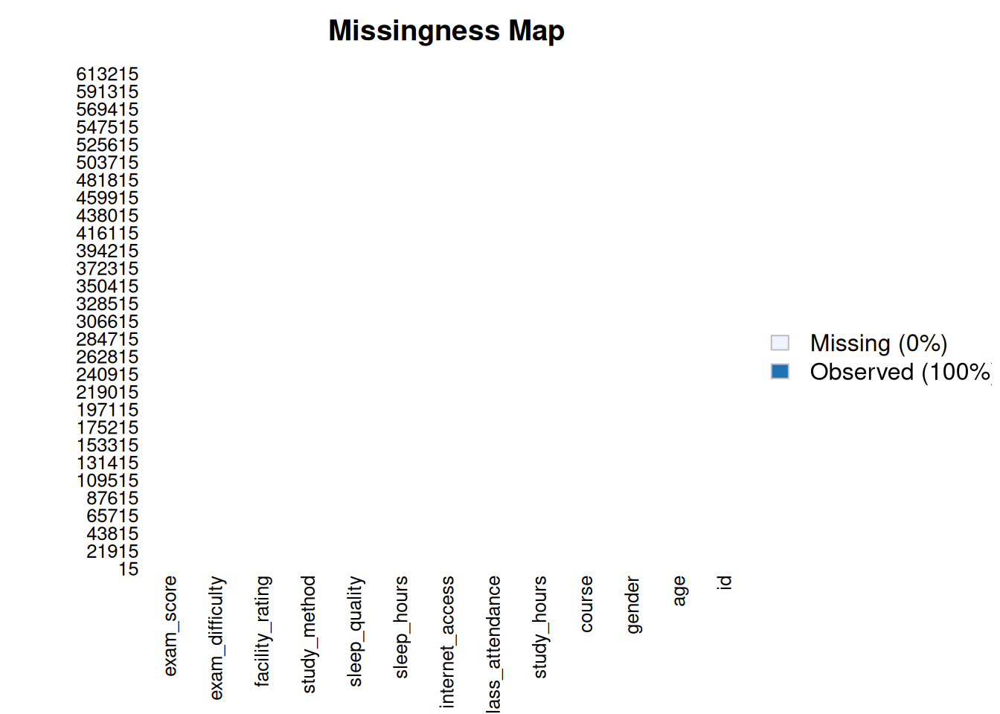


No existe ningun dato faltante en el dataset `train.csv`.

# Análisis exploratorio de datos (EDA)

## Análisis exploratorio de `exam_score` (Target)


``` r
   trainset %>% summarise(n = length(exam_score),
                 media = mean(exam_score),
                 sd = sd(exam_score),
                 mediana = median(exam_score),
                 RIC = IQR(exam_score),
                 Q1 = quantile(exam_score,0.25),
                 Q3 = quantile(exam_score,0.75),
                 minimo = min(exam_score),
                 maximo = max(exam_score),
                 asi = skewness(exam_score),
                 )
```

```
##        n    media       sd mediana  RIC   Q1   Q3 minimo maximo         asi
## 1 630000 62.50667 18.91688    62.6 27.5 48.8 76.3 19.599    100 -0.04827309
```

La variable `exam_score` fue analizada a partir de 630.000 estudiantes, donde cada fila representa un estudiante individual. El puntaje promedio es de 62,51 puntos, con una desviación estándar de 18,92 puntos, lo que refleja una dispersión moderada en el desempeño de los estudiantes. 

La mediana (62,60) es prácticamente idéntica a la media, y el RIC de 27,5 puntos (entre el primer cuartil de 48,80 y el tercer cuartil de 76,30) muestra que el 50% central de los estudiantes se concentra en una franja relativamente estrecha. Esta cercanía entre media y mediana ya anticipa una distribución simétrica, confirmada por el coeficiente de asimetría de -0,05, casi nulo.

En los extremos, el estudiante con peor desempeño obtuvo 19,60 puntos, mientras que al menos uno alcanzó el máximo posible de 100. Esto es consistente con lo observado en el histograma, donde los puntajes se distribuyen de forma bastante uniforme alrededor del centro, sin un pico muy pronunciado ni colas extendidas.


* Histograma de densidad de la variable:


``` r
trainset %>%
  ggplot(aes(x = exam_score))+
  geom_histogram(aes(y = after_stat(density)),
                     binwidth = 5,
                      fill = "#c5b0ff",
                      color = "white",
                      alpha = 0.6)+
  geom_density(color = "darkblue", linewidth = 1.2) +
  coord_cartesian(xlim = c(0, 100), expand = FALSE) +
  labs(title = 'Distribución de la nota media del examen',
       x = 'Nota media del examen',
       y = 'Densidad')+
  theme_bw()
```


Es posible apreciar que la moda se concentra entre 50 y 75 puntos de score.


* Boxplot


``` r
trainset %>%
  ggplot(aes(x = "", y= exam_score))+
  geom_boxplot(fill = "#c5b0ff", color = "darkblue",
               outlier.color = '#2f0be0')+
  stat_summary(fun = mean, geom = 'point', shape = 20,
               size = 3, color = 'black') +
  theme_bw()
```


El boxplot confirma lo visto en el histograma: la caja es simétrica, con la mediana (62,6) prácticamente centrada entre Q1 (48,8) y Q3 (76,3). Los bigotes no muestran valores atípicos.


## Análisis de las variables independientes (características)

* Inicialmente, analizaremos las variables númericas.


``` r
resumen_numericas <- trainset %>%
  select(where(is.numeric), -exam_score) %>%
  pivot_longer(
    cols = everything(),
    names_to = "variable",
    values_to = "valor"
  ) %>%
  group_by(variable) %>%
  summarise(
    n = sum(!is.na(valor)),
    media = round(mean(valor, na.rm = TRUE),3),
    ds = round(sd(valor, na.rm = TRUE),3),
    mediana = median(valor, na.rm = TRUE),
    minimo = min(valor, na.rm = TRUE),
    maximo = max(valor, na.rm = TRUE),
    Q1 = quantile(valor, 0.25, na.rm = TRUE),
    Q3 = quantile(valor, 0.75, na.rm = TRUE),
    IQR = IQR(valor, na.rm = TRUE),
    .groups = "drop"
  )

resumen_numericas
```

```
## # A tibble: 5 × 10
##   variable            n  media     ds mediana minimo maximo     Q1     Q3    IQR
##   <chr>           <int>  <dbl>  <dbl>   <dbl>  <dbl>  <dbl>  <dbl>  <dbl>  <dbl>
## 1 age            630000 2.05e1 2.26e0  2.1 e1  17    2.4 e1 1.9 e1 2.3 e1 4   e0
## 2 class_attenda… 630000 7.20e1 1.74e1  7.26e1  40.6  9.94e1 5.7 e1 8.72e1 3.02e1
## 3 id             630000 3.15e5 1.82e5  3.15e5   0    6.30e5 1.57e5 4.72e5 3.15e5
## 4 sleep_hours    630000 7.07e0 1.74e0  7.1 e0   4.1  9.9 e0 5.6 e0 8.6 e0 3   e0
## 5 study_hours    630000 4.00e0 2.36e0  4   e0   0.08 7.91e0 1.97e0 6.05e0 4.08e0
```


``` r
library(patchwork)

# Boxplot de age
p1 <- trainset %>%
  ggplot(aes(x = "", y = age)) +
  geom_boxplot(alpha = 0.7) +
  labs(title = "Edad de los estudiantes", y = "Edad", x = "") +
  theme_bw() +
  theme(plot.title = element_text(size = 10, face = "bold"))

# Boxplot de study_hours
p2 <- trainset %>%
  ggplot(aes(x = "", y = study_hours)) +
  geom_boxplot(alpha = 0.7) +
  labs(title = "Horas de estudio", y = "Horas", x = "") +
  theme_bw() +
  theme(plot.title = element_text(size = 10, face = "bold"))

# Boxplot de class_attendance
p3 <- trainset %>%
  ggplot(aes(x = "", y = class_attendance)) +
  geom_boxplot(alpha = 0.7) +
  labs(title = "Porcentaje de asistencia", y = "%", x = "") +
  theme_bw() +
  theme(plot.title = element_text(size = 10, face = "bold"))

# Boxplot de sleep_hours
p4 <- trainset %>%
  ggplot(aes(x = "", y = sleep_hours)) +
  geom_boxplot(alpha = 0.7) +
  labs(title = "Horas de sueño", y = "Horas", x = "") +
  theme_bw() +
  theme(plot.title = element_text(size = 10, face = "bold"))

# Cuadrícula 2x2
(p1 + p2) / (p3 + p4)
```


Los boxplots muestran que las cuatro variables numéricas independientes tienen distribuciones bastante simétricas, sin valores atípicos notorios.

- `age`: la mayoría de los estudiantes tiene entre 19 y 23 años, con una mediana de 21 años.
- `study_hours`: las horas de estudio varían bastante entre estudiantes, desde casi 0 hasta cerca de 8 horas, con una mediana de 4 horas.
- `class_attendance`: la asistencia se concentra entre 57% y 87%, con una mediana de 72,6%.
- `sleep_hours`: la mayoría de los estudiantes duerme entre 5,6 y 8,6 horas, con una mediana de 7,1 horas, un rango bastante saludable.

En general, ninguna de las cuatro variables muestra sesgos fuertes ni valores extremos que llamen la atención, lo cual es consistente con lo observado en las tablas resumen.


* A continuación, trabajaremos en los gráficos de las variables categoricas.


``` r
tabla_study_method <- trainset %>%
  count(study_method, name = "Frecuencia") %>%
  mutate(
    Porcentaje = round(Frecuencia / sum(Frecuencia) * 100, 2),
    Variable = "study_method",
    Categoria = as.character(study_method)
  ) %>%
  select(Variable, Categoria, Frecuencia, Porcentaje)

tabla_study_method
```

```
##       Variable     Categoria Frecuencia Porcentaje
## 1 study_method      coaching     131697      20.90
## 2 study_method   group study     123009      19.53
## 3 study_method         mixed     123086      19.54
## 4 study_method online videos     121077      19.22
## 5 study_method    self-study     131131      20.81
```


``` r
tabla_study_method <- trainset %>%
  count(study_method, name = "Frecuencia") %>%
  mutate(
    Porcentaje = round(Frecuencia / sum(Frecuencia) * 100, 1),
    Etiqueta = paste0(Frecuencia, " (", Porcentaje, "%)")
  )

ggplot(tabla_study_method, aes(x = reorder(study_method, -Frecuencia), y = Frecuencia)) +
  geom_col(fill = "#c5b0ff", width = 0.4) +
  geom_text(aes(label = Etiqueta), vjust = -0.5, size = 3.5) +
  facet_wrap(~ "Distribución de la variable study_method") +
  scale_y_continuous(expand = expansion(mult = c(0, 0.15))) +
  labs(x = "Método de estudio", y = "Frecuencia (Porcentaje)") +
  theme_bw(base_size = 12) +
  theme(
    plot.title = element_blank(),
    strip.background = element_rect(fill = "gray80", color = NA),
    strip.text = element_text(face = "bold"),
    panel.grid.major.x = element_blank()
  )
```

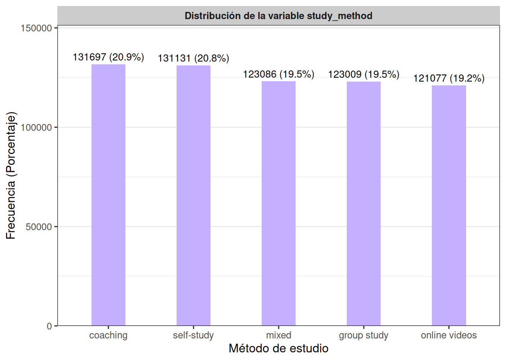

Las cinco categorías de `study_method` están bastante equilibradas entre sí: coaching (20,90%) y self-study (20,81%) son las más frecuentes, seguidas de cerca por mixed (19,54%), group study (19,53%) y online videos (19,22%). A diferencia de otras variables del dataset, aquí no se observa ninguna categoría dominante ni ninguna subrepresentada, lo que sugiere una distribución prácticamente uniforme de los métodos de estudio entre los estudiantes.


``` r
tabla_gender <- trainset %>%
  count(gender, name = "Frecuencia") %>%
  mutate(
    Porcentaje = round(Frecuencia / sum(Frecuencia) * 100, 2),
    Variable = "gender",
    Categoria = as.character(gender)
  ) %>%
  select(Variable, Categoria, Frecuencia, Porcentaje)

tabla_gender
```

```
##   Variable Categoria Frecuencia Porcentaje
## 1   gender    female     208310      33.07
## 2   gender      male     210593      33.43
## 3   gender     other     211097      33.51
```


``` r
tabla_gender <- trainset %>%
  count(gender, name = "Frecuencia") %>%
  mutate(
    Porcentaje = round(Frecuencia / sum(Frecuencia) * 100, 1),
    Etiqueta = paste0(Frecuencia, " (", Porcentaje, "%)")
  )

ggplot(tabla_gender, aes(x = reorder(gender, -Frecuencia), y = Frecuencia)) +
  geom_col(fill = "#c5b0ff", width = 0.3) +
  geom_text(aes(label = Etiqueta), vjust = -0.5, size = 3) +
  facet_wrap(~ "Distribución de la variable gender") +
  scale_y_continuous(expand = expansion(mult = c(0, 0.15))) +
  labs(x = "Género", y = "Frecuencia (Porcentaje)") +
  theme_bw(base_size = 12) +
  theme(
    plot.title = element_blank(),
    strip.background = element_rect(fill = "gray80", color = NA),
    strip.text = element_text(face = "bold"),
    panel.grid.major.x = element_blank()
  )
```

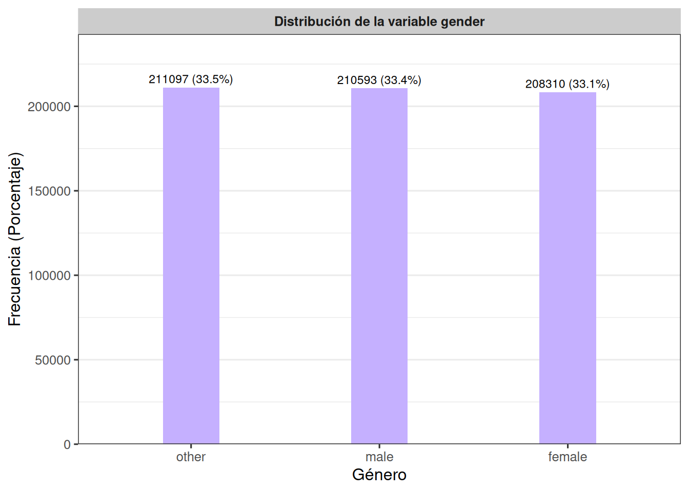

La variable gender presenta una distribución muy pareja entre sus tres categorías: other (33,51%), male (33,43%) y female (33,07%), con diferencias de apenas 0,4 puntos porcentuales entre ellas. No se observa ningún desbalance relevante.


``` r
tabla_internet_access <- trainset %>%
  count(internet_access, name = "Frecuencia") %>%
  mutate(
    Porcentaje = round(Frecuencia / sum(Frecuencia) * 100, 2),
    Variable = "internet_access",
    Categoria = as.character(internet_access)
  ) %>%
  select(Variable, Categoria, Frecuencia, Porcentaje)

tabla_internet_access
```

```
##          Variable Categoria Frecuencia Porcentaje
## 1 internet_access        no      50577       8.03
## 2 internet_access       yes     579423      91.97
```


``` r
tabla_internet_access <- trainset %>%
  count(internet_access, name = "Frecuencia") %>%
  mutate(
    Porcentaje = round(Frecuencia / sum(Frecuencia) * 100, 1),
    Etiqueta = paste0(Frecuencia, " (", Porcentaje, "%)")
  )

ggplot(tabla_internet_access, aes(x = reorder(internet_access, -Frecuencia), y = Frecuencia)) +
  geom_col(fill = "#c5b0ff", width = 0.3) +
  geom_text(aes(label = Etiqueta), vjust = -0.5, size = 3.5) +
  facet_wrap(~ "Distribución de la variable internet_access") +
  scale_y_continuous(expand = expansion(mult = c(0, 0.6))) +
  labs(x = "Acceso a internet", y = "Frecuencia (Porcentaje)") +
  theme_bw(base_size = 12) +
  theme(
    plot.title = element_blank(),
    strip.background = element_rect(fill = "gray80", color = NA),
    strip.text = element_text(face = "bold"),
    panel.grid.major.x = element_blank()
  )
```

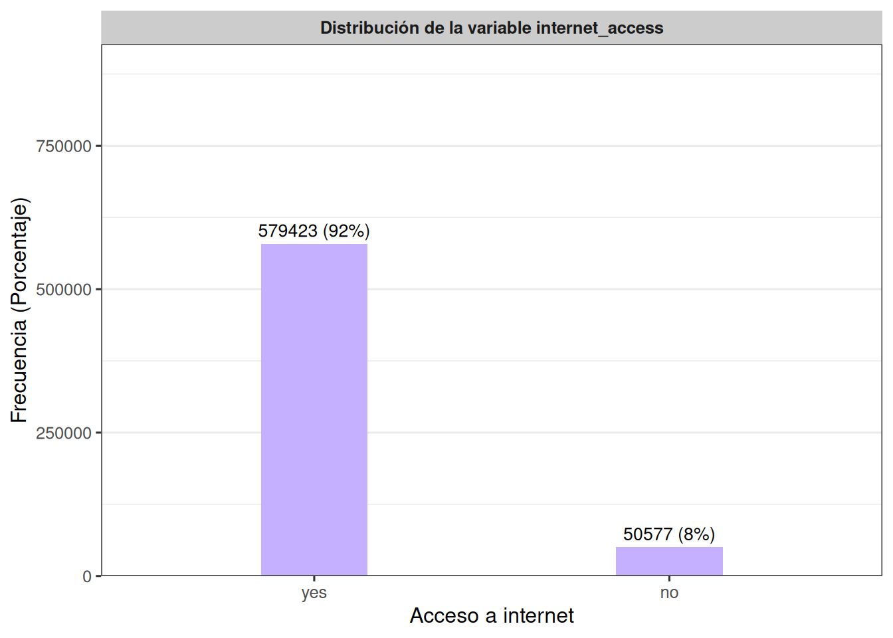

Aquí sí hay un desbalance marcado: el 91,97% de los estudiantes cuenta con acceso a internet (yes), mientras que solo el 8,03% no lo tiene (no). Esto podría influir en la robustez de futuras comparaciones entre ambos grupos, dado el tamaño tan reducido de quienes no cuentan con acceso.


``` r
tabla_course <- trainset %>%
  count(course, name = "Frecuencia") %>%
  mutate(
    Porcentaje = round(Frecuencia / sum(Frecuencia) * 100, 2),
    Variable = "course",
    Categoria = as.character(course)
  ) %>%
  select(Variable, Categoria, Frecuencia, Porcentaje)

tabla_course
```

```
##   Variable Categoria Frecuencia Porcentaje
## 1   course     b.com     110932      17.61
## 2   course      b.sc     111554      17.71
## 3   course    b.tech     131236      20.83
## 4   course        ba      61989       9.84
## 5   course       bba      75644      12.01
## 6   course       bca      88721      14.08
## 7   course   diploma      49924       7.92
```


``` r
tabla_course <- trainset %>%
  count(course, name = "Frecuencia") %>%
  mutate(
    Porcentaje = round(Frecuencia / sum(Frecuencia) * 100, 1),
    Etiqueta = paste0(Frecuencia, " (", Porcentaje, "%)")
  )

ggplot(tabla_course, aes(x = reorder(course, -Frecuencia), y = Frecuencia)) +
  geom_col(fill = "#c5b0ff", width = 0.45) +
  geom_text(aes(label = Etiqueta), vjust = -0.5, size = 2.8) +
  facet_wrap(~ "Distribución de la variable course") +
  scale_y_continuous(expand = expansion(mult = c(0, 0.15))) +
  labs(x = "Curso", y = "Frecuencia (Porcentaje)") +
  theme_bw(base_size = 12) +
  theme(
    plot.title = element_blank(),
    strip.background = element_rect(fill = "gray80", color = NA),
    strip.text = element_text(face = "bold"),
    panel.grid.major.x = element_blank()
  )
```

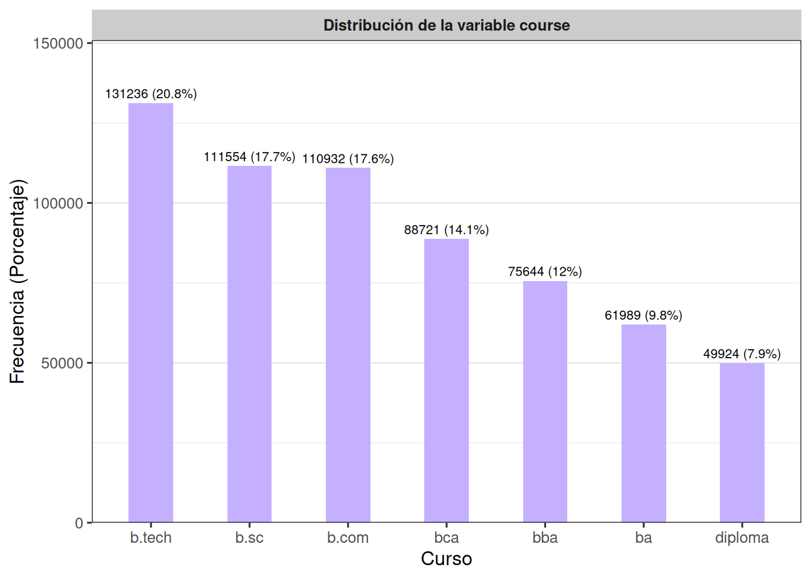

La categoría b.tech concentra la mayor proporción de estudiantes (20,83%), seguida por b.sc (17,71%) y b.com (17,61%). En conjunto, estas tres representan cerca del 56% del total. En el otro extremo, diploma es la categoría menos representada (7,92%), seguida por ba (9,84%). A diferencia de internet_access, aquí el desbalance es más moderado, con 7 categorías que oscilan entre el 8% y el 21%.


``` r
tabla_sleep_quality <- trainset %>%
  count(sleep_quality, name = "Frecuencia") %>%
  mutate(
    Porcentaje = round(Frecuencia / sum(Frecuencia) * 100, 2),
    Variable = "sleep_quality",
    Categoria = as.character(sleep_quality)
  ) %>%
  select(Variable, Categoria, Frecuencia, Porcentaje)

tabla_sleep_quality
```

```
##        Variable Categoria Frecuencia Porcentaje
## 1 sleep_quality   average     203236      32.26
## 2 sleep_quality      good     213089      33.82
## 3 sleep_quality      poor     213675      33.92
```


``` r
tabla_sleep_quality <- trainset %>%
  count(sleep_quality, name = "Frecuencia") %>%
  mutate(
    Porcentaje = round(Frecuencia / sum(Frecuencia) * 100, 1),
    Etiqueta = paste0(Frecuencia, " (", Porcentaje, "%)")
  )

ggplot(tabla_sleep_quality, aes(x = reorder(sleep_quality, -Frecuencia), y = Frecuencia)) +
  geom_col(fill = "#c5b0ff", width = 0.3) +
  geom_text(aes(label = Etiqueta), vjust = -0.5, size = 3.5) +
  facet_wrap(~ "Distribución de la variable sleep_quality") +
  scale_y_continuous(expand = expansion(mult = c(0, 0.15))) +
  labs(x = "Calidad del sueño", y = "Frecuencia (Porcentaje)") +
  theme_bw(base_size = 12) +
  theme(
    plot.title = element_blank(),
    strip.background = element_rect(fill = "gray80", color = NA),
    strip.text = element_text(face = "bold"),
    panel.grid.major.x = element_blank()
  )
```

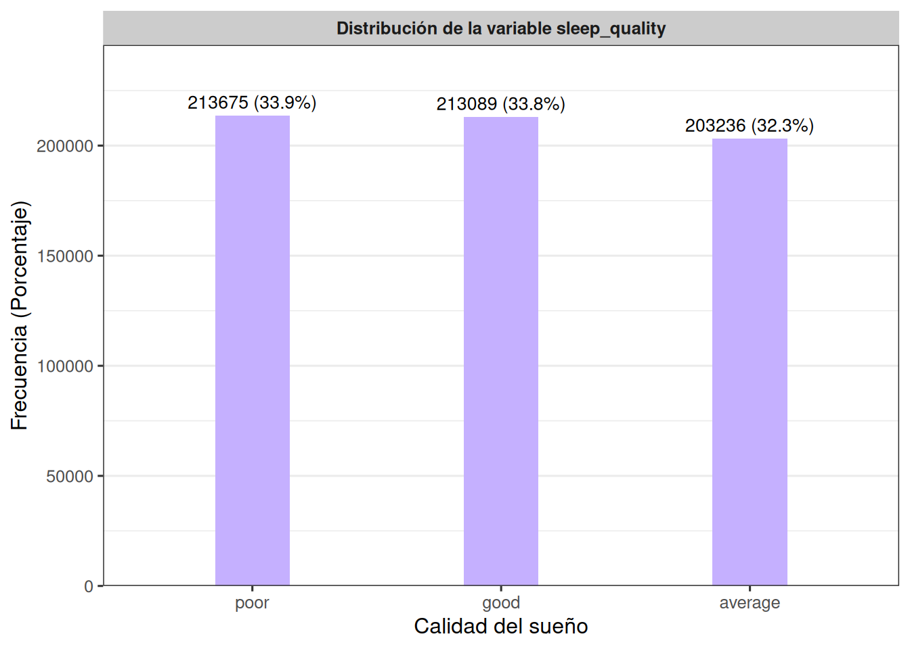

Las tres categorías de sleep_quality están distribuidas de forma casi idéntica: poor (33,92%), good (33,82%) y average (32,26%), con una diferencia máxima de apenas 1,7 puntos porcentuales entre ellas. No se evidencia ningún patrón de concentración hacia una categoría en particular.


``` r
tabla_facility_rating <- trainset %>%
  count(facility_rating, name = "Frecuencia") %>%
  mutate(
    Porcentaje = round(Frecuencia / sum(Frecuencia) * 100, 2),
    Variable = "facility_rating",
    Categoria = as.character(facility_rating)
  ) %>%
  select(Variable, Categoria, Frecuencia, Porcentaje)

tabla_facility_rating
```

```
##          Variable Categoria Frecuencia Porcentaje
## 1 facility_rating      high     203540      32.31
## 2 facility_rating       low     212378      33.71
## 3 facility_rating    medium     214082      33.98
```


``` r
tabla_facility_rating <- trainset %>%
  count(facility_rating, name = "Frecuencia") %>%
  mutate(
    Porcentaje = round(Frecuencia / sum(Frecuencia) * 100, 1),
    Etiqueta = paste0(Frecuencia, " (", Porcentaje, "%)")
  )

ggplot(tabla_facility_rating, aes(x = reorder(facility_rating, -Frecuencia), y = Frecuencia)) +
  geom_col(fill = "#c5b0ff", width = 0.3) +
  geom_text(aes(label = Etiqueta), vjust = -0.5, size = 3.5) +
  facet_wrap(~ "Distribución de la variable facility_rating") +
  scale_y_continuous(expand = expansion(mult = c(0, 0.15))) +
  labs(x = "Calificación de instalaciones", y = "Frecuencia (Porcentaje)") +
  theme_bw(base_size = 12) +
  theme(
    plot.title = element_blank(),
    strip.background = element_rect(fill = "gray80", color = NA),
    strip.text = element_text(face = "bold"),
    panel.grid.major.x = element_blank()
  )
```

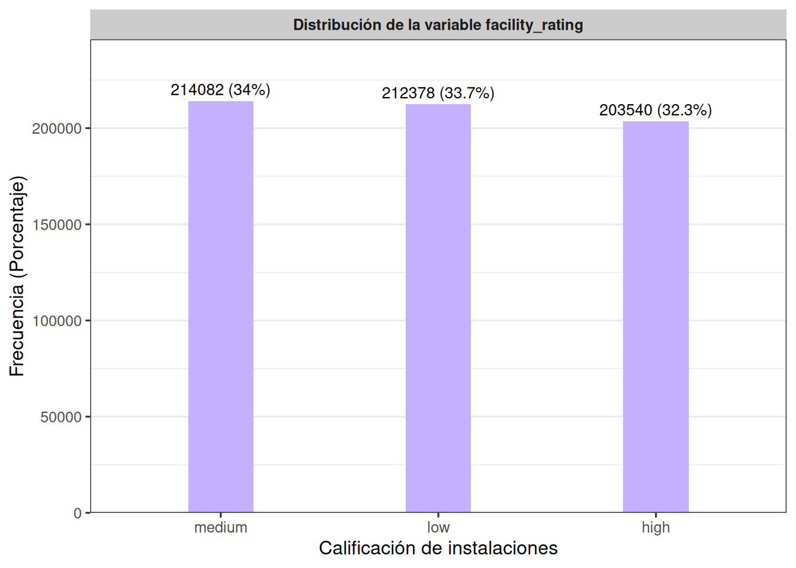

De forma similar a sleep_quality, las tres categorías de facility_rating se reparten de manera equilibrada: medium (33,98%), low (33,71%) y high (32,31%), sin ninguna diferencia relevante entre ellas.


``` r
tabla_exam_difficulty <- trainset %>%
  count(exam_difficulty, name = "Frecuencia") %>%
  mutate(
    Porcentaje = round(Frecuencia / sum(Frecuencia) * 100, 2),
    Variable = "exam_difficulty",
    Categoria = as.character(exam_difficulty)
  ) %>%
  select(Variable, Categoria, Frecuencia, Porcentaje)

tabla_exam_difficulty
```

```
##          Variable Categoria Frecuencia Porcentaje
## 1 exam_difficulty      easy     176540      28.02
## 2 exam_difficulty      hard      99478      15.79
## 3 exam_difficulty  moderate     353982      56.19
```


``` r
tabla_exam_difficulty <- trainset %>%
  count(exam_difficulty, name = "Frecuencia") %>%
  mutate(
    Porcentaje = round(Frecuencia / sum(Frecuencia) * 100, 1),
    Etiqueta = paste0(Frecuencia, " (", Porcentaje, "%)")
  )

ggplot(tabla_exam_difficulty, aes(x = reorder(exam_difficulty, -Frecuencia), y = Frecuencia)) +
  geom_col(fill = "#c5b0ff", width = 0.3) +
  geom_text(aes(label = Etiqueta), vjust = -0.5, size = 3.5) +
  facet_wrap(~ "Distribución de la variable exam_difficulty") +
  scale_y_continuous(expand = expansion(mult = c(0, 0.15))) +
  labs(x = "Dificultad del examen", y = "Frecuencia (Porcentaje)") +
  theme_bw(base_size = 12) +
  theme(
    plot.title = element_blank(),
    strip.background = element_rect(fill = "gray80", color = NA),
    strip.text = element_text(face = "bold"),
    panel.grid.major.x = element_blank()
  )
```

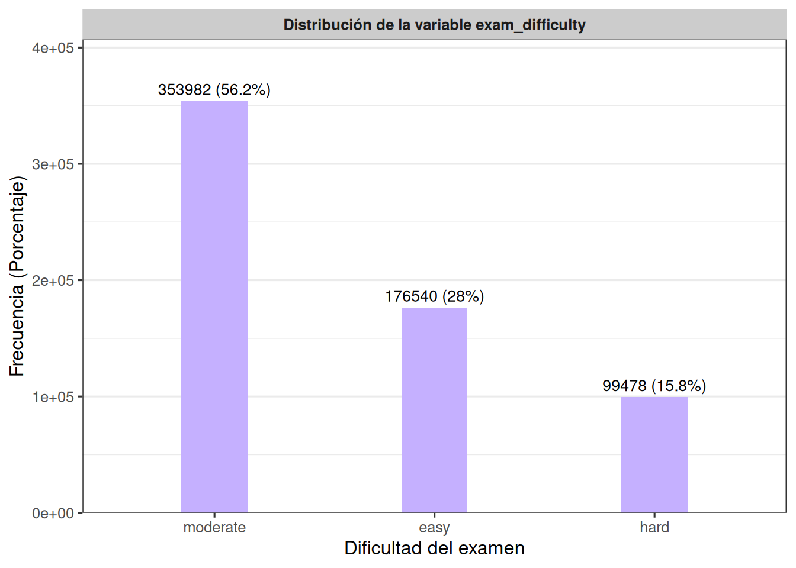

Esta es la variable categórica con mayor desbalance después de internet_access: la categoría moderate concentra más de la mitad de las observaciones (56,19%), mientras que easy representa el 28,02% y hard apenas el 15,79%. Esto sugiere que la mayoría de los exámenes fueron catalogados con una dificultad intermedia, y muy pocos como difíciles.


## Análisis exploratorio bivariado

A continuación, analizaremos la relación entre la variable objetivo `exam_score` y las variables numéricas independientes, con el fin de identificar posibles patrones, tendencias y asociaciones que puedan ser útiles para la construcción de modelos.


``` r
cor(trainset$age, trainset$exam_score, method = "pearson")
```

```
## [1] 0.01047241
```

``` r
# Diagrama de dispersión: age vs exam_score
trainset %>%
  ggplot(aes(x = age, y = exam_score)) +
  geom_point(alpha = 0.4, color = "#c5b0ff") +
  geom_smooth(method = "lm", formula = y ~ x, se = FALSE, color = "darkblue") +
  labs(
    x = "Edad media",
    y = "Calificación media del examen"
  ) +
  theme_bw() +
  facet_grid(. ~ "Dispersión entre la edad media y la calificación de los exámenes")
```

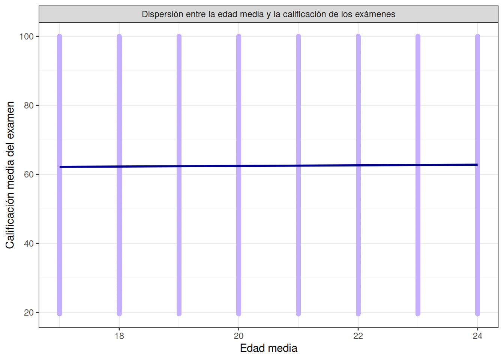

El diagrama de dispersión muestra que la calificación del examen se distribuye de forma similar en todas las edades (17 a 24 años), con puntos que cubren prácticamente todo el rango de 20 a 100 puntos en cada grupo etario. La línea de tendencia es casi plana, lo que sugiere que no existe una relación lineal relevante entre la edad y el desempeño académico: los estudiantes más jóvenes y los mayores obtienen calificaciones igual de variadas.


``` r
# Diagrama de dispersión: study_hours vs exam_score
trainset %>%
  ggplot(aes(x = study_hours, y = exam_score)) +
  geom_point(alpha = 0.4, color = "#c5b0ff") +
  geom_smooth(method = "lm", formula = y ~ x, se = FALSE, color = "darkblue") +
  labs(
    x = "Horas de estudio media",
    y = "Calificación media del examen"
  ) +
  theme_bw() +
  facet_grid(. ~ "Dispersión entre las horas de estudio media y la calificación de los exámenes")
```

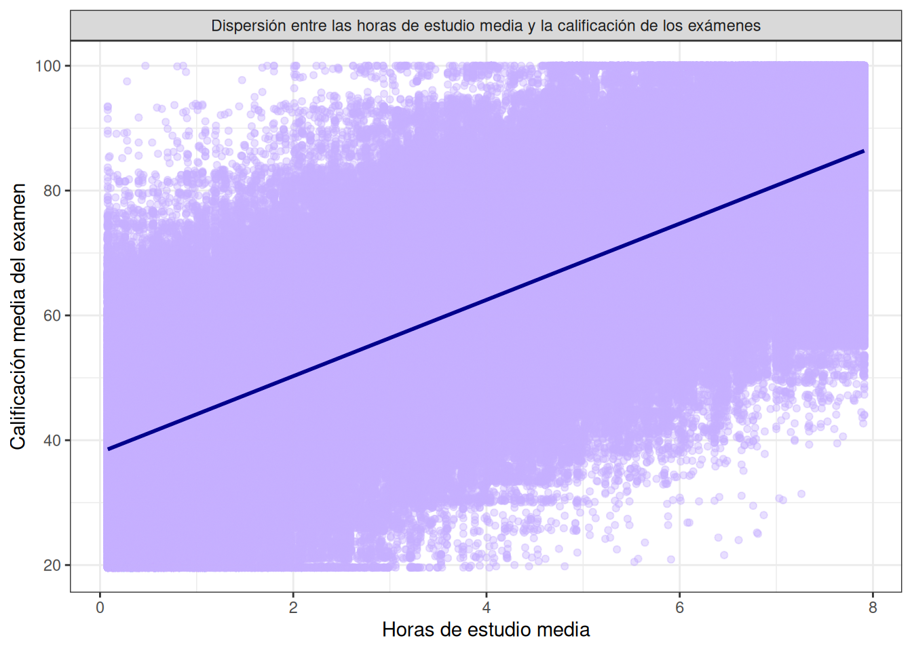


``` r
# Diagrama de dispersión: class_attendance vs exam_score
trainset %>%
  ggplot(aes(x = class_attendance, y = exam_score)) +
  geom_point(alpha = 0.4, color = "#c5b0ff") +
  geom_smooth(method = "lm", formula = y ~ x, se = FALSE, color = "darkblue") +
  labs(
    x = "asistencia a clases media",
    y = "Calificación media del examen"
  ) +
  theme_bw() +
  facet_grid(. ~ "Dispersión entre la asistencia a clases media y la calificación de los exámenes")
```

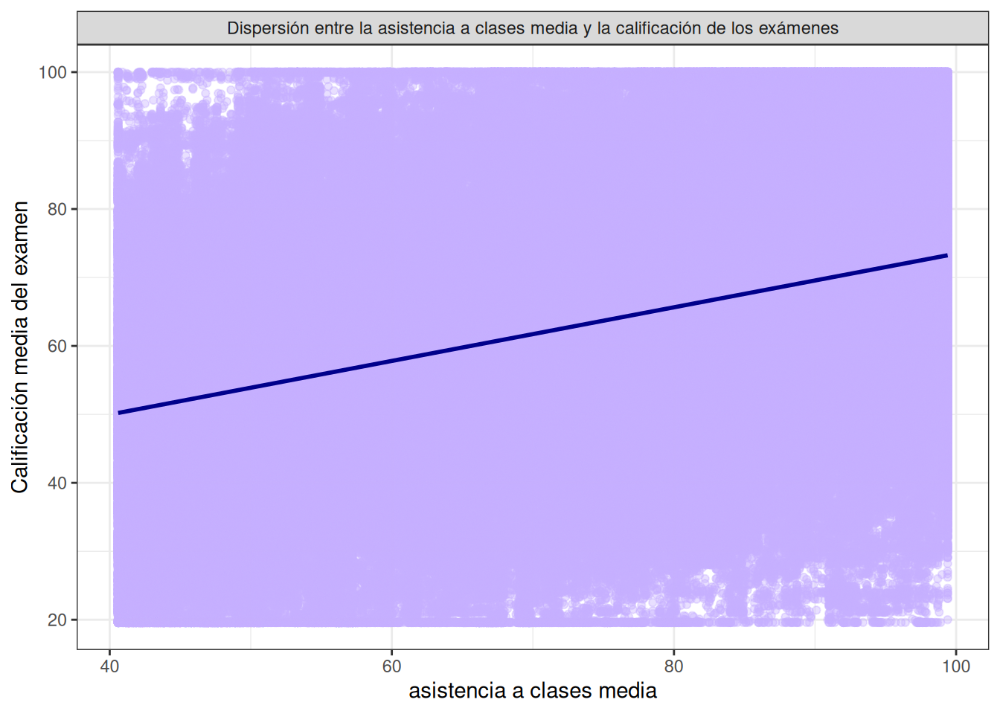


``` r
# Diagrama de dispersión: sleep_hours vs exam_score
trainset %>%
  ggplot(aes(x = sleep_hours, y = exam_score)) +
  geom_point(alpha = 0.4, color = "#c5b0ff") +
  geom_smooth(method = "lm", formula = y ~ x, se = FALSE, color = "darkblue") +
  labs(
    x = "horas de sueño media",
    y = "Calificación media del examen"
  ) +
  theme_bw() +
  facet_grid(. ~ "Dispersión horas de sueño media y la calificación de los exámenes")
```

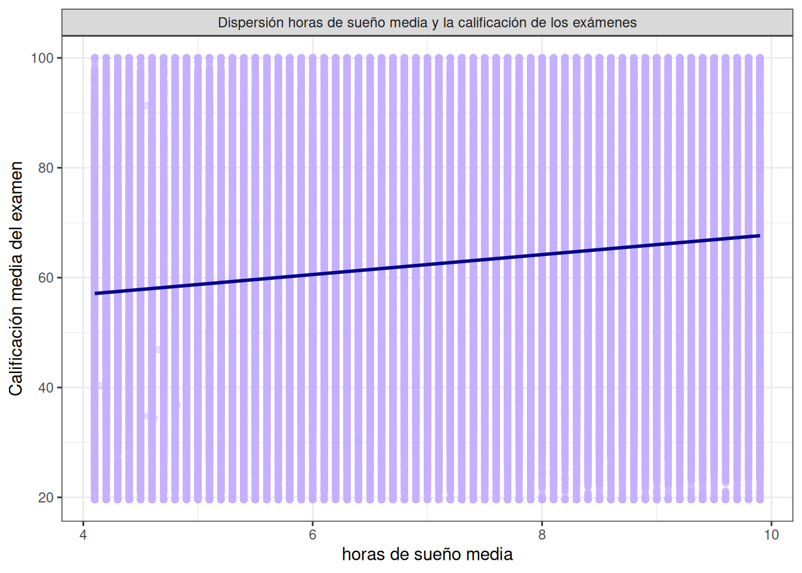


# Análisis de estadística paramétrica y no paramétrica

* Empecemos con `internet_access` vs `exam_score`


``` r
# dataframe de acceso
Ac <- trainset %>% 
  filter(internet_access == "yes")

# dataframe de no acceso
Nac <- trainset %>% 
  filter(internet_access == "no")
```

Debido a que la muestra es mayor de 5.000 descartamos el uso de la Shapiro-Wilk.


``` r
lillie.test(Ac$exam_score)
```

```
## 
## 	Lilliefors (Kolmogorov-Smirnov) normality test
## 
## data:  Ac$exam_score
## D = 0.023561, p-value < 2.2e-16
```

``` r
lillie.test(Nac$exam_score)
```

```
## 
## 	Lilliefors (Kolmogorov-Smirnov) normality test
## 
## data:  Nac$exam_score
## D = 0.027935, p-value < 2.2e-16
```

La prueba de Lilliefors muestra que el puntaje del examen `exam_score` no presenta un comportamiento normal en ninguno de los dos grupos analizados. En el caso de los estudiantes con acceso a internet $(D = 0.023561, p-valor < 0.001)$; mientras que para los estudiantes sin acceso a internet $(D = 0.027935, p-valor < 0.001)$.


``` r
trainset %>%
  wilcox_test(exam_score ~ internet_access, paired = FALSE)
```

```
## # A tibble: 1 × 7
##   .y.        group1 group2    n1     n2    statistic      p
## * <chr>      <chr>  <chr>  <int>  <int>        <dbl>  <dbl>
## 1 exam_score no     yes    50577 579423 14565777034. 0.0266
```

La prueba de Mann-Whitney-Wilcoxon para muestras independientes nos indica que, con una confianza del 95%, se concluye que existe una diferencia estadísticamente significativa en el puntaje del examen `exam_score` entre los estudiantes con y sin acceso a internet $(W=14565777034, p-valor=0.0266)$.


``` r
trainset %>%
  wilcox_effsize(exam_score ~ internet_access, paired = FALSE)
```

```
## # A tibble: 1 × 7
##   .y.        group1 group2 effsize    n1     n2 magnitude
## * <chr>      <chr>  <chr>    <dbl> <int>  <int> <ord>    
## 1 exam_score no     yes    0.00279 50577 579423 small
```
Con base en el resultado del tamaño del efecto $r$, se obtiene un valor estimado de 0.0028 (magnitud: pequeña), lo que indica un efecto prácticamente nulo. Esto indica que, aunque la diferencia es estadísticamente significativa, no es relevante desde el punto de vista práctico — el acceso a internet no parece tener una influencia considerable en el desempeño académico de los estudiantes.

* Sigamos con `gender` vs `exam_score`:


``` r
# OTHER
Other <- trainset %>% 
  filter(gender == "other")

# MALE
Male <- trainset %>% 
  filter(gender == "male")

# FEMALE
Female <- trainset %>%
  filter (gender == "female")
```


``` r
lillie.test(Other$exam_score)
```

```
## 
## 	Lilliefors (Kolmogorov-Smirnov) normality test
## 
## data:  Other$exam_score
## D = 0.025855, p-value < 2.2e-16
```

``` r
lillie.test(Male$exam_score)
```

```
## 
## 	Lilliefors (Kolmogorov-Smirnov) normality test
## 
## data:  Male$exam_score
## D = 0.021919, p-value < 2.2e-16
```

``` r
lillie.test(Female$exam_score)
```

```
## 
## 	Lilliefors (Kolmogorov-Smirnov) normality test
## 
## data:  Female$exam_score
## D = 0.023756, p-value < 2.2e-16
```

La prueba de Lilliefors muestra que el puntaje del examen `exam_score` no presenta un comportamiento normal en ninguno de los tres grupos analizados según género. Para el grupo "other" $(D = 0.025855, p-valor < 0.001)$; para el grupo masculino $(D = 0.021919, p-valor < 0.001)$; y para el grupo femenino $(D = 0.023756, p-valor < 0.001)$.


``` r
kruskal.test(exam_score ~ gender, data = trainset)
```

```
## 
## 	Kruskal-Wallis rank sum test
## 
## data:  exam_score by gender
## Kruskal-Wallis chi-squared = 81.54, df = 2, p-value < 2.2e-16
```

La prueba de Kruskal-Wallis nos indica que, con una confianza del 95%, se concluye que existe una diferencia estadísticamente significativa en el puntaje del examen `exam_score` entre al menos uno de los grupos de género $(χ²₍₂₎ = 81.54, p-valor < 0.001)$.


``` r
trainset %>%
  kruskal_effsize(exam_score ~ gender)
```

```
## # A tibble: 1 × 5
##   .y.             n  effsize method  magnitude
## * <chr>       <int>    <dbl> <chr>   <ord>    
## 1 exam_score 630000 0.000126 eta2[H] small
```

Con base en el resultado del tamaño del efecto $(η² = 0.000126, magnitud: pequeña)$, se obtiene un valor prácticamente nulo. Esto indica que, aunque la diferencia entre los grupos de género es estadísticamente significativa, no es relevante desde el punto de vista práctico — el género explica una proporción mínima de la variabilidad en el puntaje del examen, por lo que no parece ser un factor determinante en el desempeño académico de los estudiantes.


<!--chapter:end:Predicting-student-test-scores.Rmd-->

